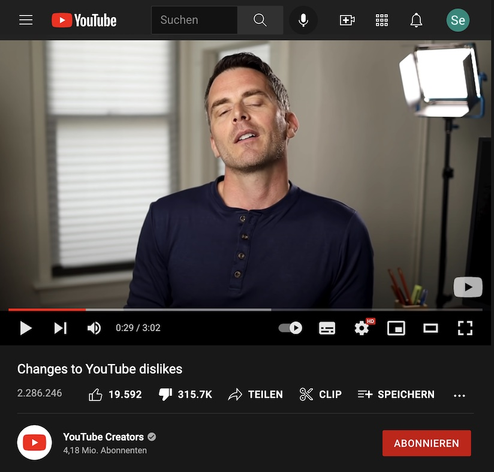

# Bringing back youtube dislikes as a Chrome Extension!


Project structure forked from [chrome extension typescript starter](https://github.com/chibat/chrome-extension-typescript-starter) ♥️

## WHY?

YouTube removed the dislike count but dislike for most videos are still available via YouTube Data API v3 - so I wrote this to see whether I can actually publish this Extension to the Chrome Web Store. Also for certain kinds of videos like tutorials, dislikes are an important quick estimator for users. 

## Prerequisites

* [node + yarn](https://nodejs.org/) (Current Version)
* YouTube Data API v3 API Key [(getting started with Data API v3)](https://developers.google.com/youtube/v3/getting-started)

## Project Structure

* src/typescript: TypeScript source files
* src/assets: static files
* dist: Chrome Extension directory
* dist/js: Generated JavaScript files

## Setup

```
yarn
```

create a file called .env in the root folder of this project. The contents of .env are as follows:
```
API_KEY=YOUR_API_KEY_GOES_HERE
```

## Build

```
yarn build
```

## Build in watch mode

```
yarn watch
```

## Load extension to chrome

Load `dist` directory as unpacked extension, remember to provide your own API_KEY via .env file at project root folder
